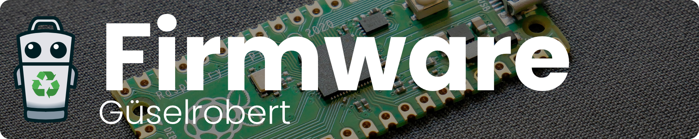

# Firmware

The firmware is developed (or is being developed as of writing) in C/C++ using a Raspberry Pi Pico and the [Raspberry Pi Pico SDK](https://github.com/raspberrypi/pico-sdk)  toolchain.

- `/src/`:  contains the Source files
- `/inc/`: contains the Header files
- [Doing The Math](doing_the_math.md) explains the math behind the angle calculations (:warning: not yet completed :warning:)

## Guides

- Digikey's Guide on how to use the Pico SDK ([Youtube-Playlist](https://www.youtube.com/playlist?list=PLEBQazB0HUyQO6rJxKr2umPCgmfAU-cqR))
- Shawn Hymel's Guide on the installation process ([Blog](https://shawnhymel.com/2096/how-to-set-up-raspberry-pi-pico-c-c-toolchain-on-windows-with-vs-code/))