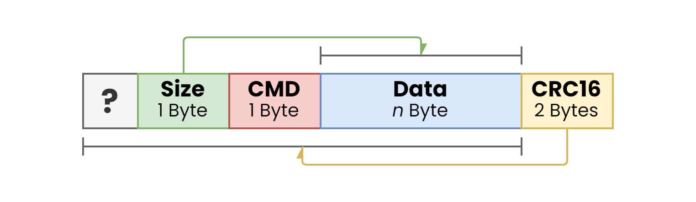
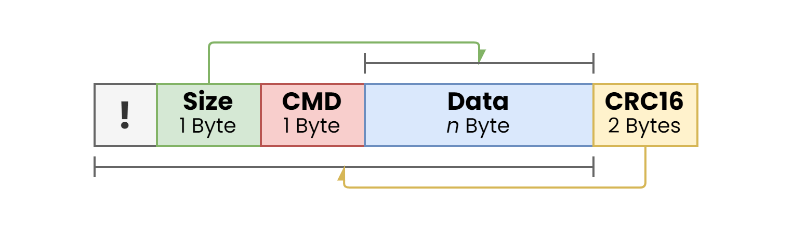

# Communication Protocol
#todo


> **Note** #todo 
> - [ ] Add `wait_for_response`
> - [ ] Create test cases & test system
> - [ ] Implement history buffer to send data.

The communication protocol is built around a "simple" Request Response scheme, where the tasks and relationship between two communication devices is predefined (master-slave-communication or same-leveled communication). It is used for the distribution of information and commands between two devices.

## To-Do


## Workflow
1. Sender sents request package for information or setting information
2. Receiver checks wherever the package is valid
	- Send error when necessary & reset state
3. Receiver prepares response package and sends it to the receiver
4. Sender checks if the response is valid
	- Send error when necessary 

## Attaching Functions to Commands
By default, each command is connected to a default function, which doesn't do anything. To have  a command do something, the function needs to be attached using the `attach`-method of the communication library `RobotCommunication` / `robocom.h`.

```cpp
bool attach(uint8_t command, robocom_callback_t callback)
```

The `attach`-method requires two parameters: the command, given as an unsigned 8-bit integer and the callback function using the `robocom_callback_t`-signature. `robocom_callback_t` represents a function pointer which returns nothing (`void`) and has two parameters, representing the start of the data reference (`uint8_t*`; which is the address to the data-segment in the buffer) and the size of the data (`uint8_t`).

> **Warning**
> Since it's the C/C++ language, memory & array-indexing handling requires special attention. Unable to handle it correctly can lead to memory leaks or unintentional data corruption.

```cpp
void (*robocom_callback_t)(uint8_t* data, uint8_t size)
```

### Calling a command

To execute a command, a **request** package needs to be received (point of view from receiver). Once the package is fully received, the process executes the package directly after receiving the last CRC16-byte and validating the received data.

> **Note**
> The attached function gets executed, when the **whole** request-package is correctly **received**.

### Errorhandling
There are two types of errors: process errors and parameter specific errors. Process errors are triggered when either the timeout has been reached or the checksum is incorrect. Sending an incorrect start symbol is simply ignored.

**Process Errors**
| Type     | Description                                                                                                                                                                                                                                                                                                |
| -------- | ---------------------------------------------------------------------------------------------------------------------------------------------------------------------------------------------------------------------------------------------------------------------------------------------------------- |
| Timeout  | The Timeout starts after receiving a valid start symbol. The timeout is defined by the definiton `WATCHDOG_TIMING_MS` and has a default value of 100ms (`100`). When the package is not completed in the timespan of  `WATCHDOG_TIMING_MS`, the timeout error is triggered and the whole process is reset. |
| Checksum | The checksum is used to detect if the package is invalid by comparing the data checksum of the received package with the calculated one. If one checksum differs from the other, the packet is invalid and must be sent again.                                                                             | 

**Parameter Specific Errors**
This type of error depends on the implementation and what kind of errors is desired. This is up to the user on where or when the error is called.


### Example
```cpp
RobotCommunication robocom = RobotCommunication();

int main(void) {
// attach 'test_set_led' to command 1
  robocom.attach(0x1, test_set_led);
// attach 'test_clear_led' to command 2
  robocom.attach(0x2, test_clear_led);
// attach 'test_toggle_led' to command 3
  robocom.attach(0x3, test_toggle_led);
}
```


## Request


## Response


## Error


| Code  | Beschreibung  |
| ----- | ------------- |
| `0x0` | Timeout Error | 