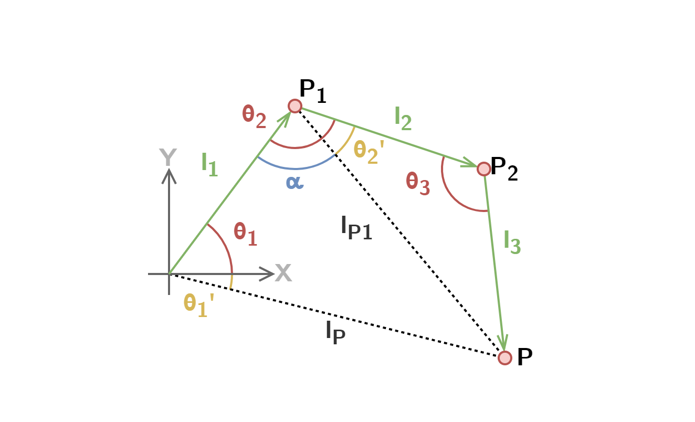
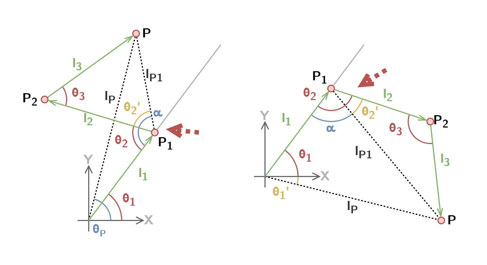

# Calculations of Angles to Goal Position

The robot arm works using the principle of inverse kinematic and in a short explanation does following: get the desination coordinates and calculate the relative angles for each arm segment. Most of the formulas were taken from Alan Zucconi's blog post "[Inverse Kinematics in 2D – Part 1](https://www.alanzucconi.com/2018/05/02/ik-2d-1/)" and adjusted from two segments to three segments.

The main difficulty in calculating the angles for a three segmented arm is that there are **infinite** possible solutions. This isn't good for embedded systems and therefore there are some limitations & compromises to be considered. It allows for easier calculations of the angle. For this arm, the angle $\theta_1$ of the main segment gets precalculated angles depending on the destination coordinates. This makes $\theta_1$ a constant and allows for much simpler calculations, that can be put on a microcontroller.

> **Note**
> 
> ## Calculate Index Positions
> 
> To calculate the index of the destination coordinates, the given coordinates are divided by a chunk variable $n$. After flooring the result, it represents an index for a chunk.
> 
> $$
> i_x = \left\lfloor \frac{x_P}{n} \right\rfloor \qquad i_y = \left\lfloor \frac{y_P}{n} \right\rfloor
> $$
> 
> Each chunk contains a precalculated angle for $\theta_1$.
> 
> **Important**: As the angle is precalculated and separated into chunks, it limits the available working space a bit. But the smaller the chunks are, the bigger the available space is.
> 
> ---
> 
> **Alternative**: A possible alternative would be to calculate the angle $\theta_1$  to be the same as the angle $\theta_P$.
> 
> $$
> \theta_1 = \theta_P = \arctan{\left(\frac{y_1}{x_1}\right)}
> $$

## GeoGebra Functions

Before the embedded solution was implemented, a GeoGebra script has been created to test out the theory. First the length to the destination $P$ from the origin points is calculated. The coordinates of the first Point $P_1$ is calculated…

$$
l_{P}=\sqrt{x_{P}^2+y_{P}^2} \qquad x_1=l_1\cdot\sin(\theta_1) \qquad y_1=l_1\cdot\cos(\theta_1)
$$

… and with it, the length from $P_1$ to $P$ can be calculated, which reduces the system to a two segmented system.

$$
l_{P1} = \sqrt{(x_P-x_1)^2+(y_P-y_1)^2}
$$

Then, the cosine theorem with $l_{P1}$ is used to calculate the segment angle $\theta_3$.

$$
\theta_3=\arccos{\left(\frac{l_{2}^2+l_{3}^2-l_{P1}^2}{2\cdot l_{2}\cdot l_{3}}\right)}
$$

To calculate $\theta_2$, two separate angles need to be calculated in between, $\alpha$ and $\theta_2'$. The following figure shows the correlations of the angles to the position of the destination $P$. $\theta_2$ needs to be calculated differently depending on the position of $P$.

$$
\alpha = \arccos{\left(\frac{l_{P1}^2+l_{1}^2-l_{P}^2}{2\cdot l_{P1}\cdot l_{1}}\right)} \qquad \theta_2' = \arccos{\left(\frac{l_{P1}^2+l_{2}^2-l_{3}^2}{2\cdot l_{P1}\cdot l_{2}}\right)}
$$

Now the calculation steps depend on which side $P$ is located. The location can be calculated using the slope $m$ of $l_1$ and comparing $m\cdot x_P$ with $y_P$. The following function checks wherever the point $P$ is on the left (on `true`) or right (on `false`) side of the line at angle $\theta_1$.

$$
[(m\geq 0) \wedge(m\cdot x_P \leq y_P)] \vee [(m\leq 0) \wedge(m\cdot x_P \geq y_P)]
$$

- $P$ left of $l_1$: both the angles are added together. 
- $P$ right of $l_1$: $\theta_2'$ is subtracted from $\alpha$

$$
m=\frac{y_1}{x_1}
$$

$$
{\theta}_2 = \left\\{  \begin{matrix} \alpha + {\theta}_2' & [(m\geq 0) \wedge(m\cdot x_P \leq y_P)] \vee [(m\leq 0) \wedge(m\cdot x_P \geq y_P)] \\ \alpha - {\theta}_2' & \text{else} \\ \end{matrix} \right\\}
$$

The function $[(m\geq 0) \wedge(m\cdot x_P \leq y_P)] \vee [(m\leq 0) \wedge(m\cdot x_P \geq y_P)]$ checks wherever the point $P$ is one the left (on `true`) or right (on `false`) side of the line at angle $\theta_1$.

> **Warning**
> This is not yet complete as there are still some things missing, such as:
> 
> - Region Limiting
> - Inverting

$\longrightarrow$ Click [GeoGebra-Script](https://www.geogebra.org/classic/jtgqn3yd) to open up the script.

## Miscellaneous

> **Note**
> 
> ### Calculating Point $P_1$, $P_2$ Coordinates
> 
> To calculate all the most important coordinates, following calculations can be used.
> 
> **Point** $P_1$
> 
> $$
> x_1=l_1\cdot\sin(\theta_1) \qquad y_1=l_1\cdot\cos(\theta_1)
> $$
> 
> **Point** $P_2$
> 
> $$
> \beta = \theta_{2}-\arcsin{\left(\frac{x_{1}}{l_{1}}\right)}-90\degree
> $$
> 
> $$
> x_2=x_1 + l_2\cdot\sin{\beta} \qquad y_2=y_1 + l_2\cdot\cos{\beta}
> $$
